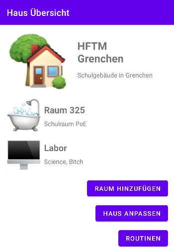
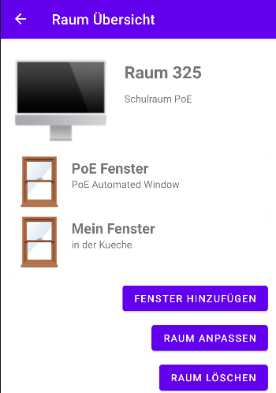
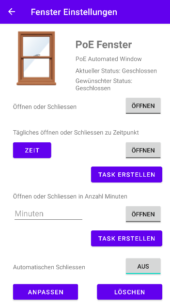
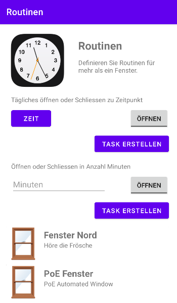

<div id="top"></div>
<!-- TEMPLATE SOURCE -->
<!-- 
*** This is a template to document a readme.
*** Not enough time to create one from scratch.
*** Credits to: https://github.com/othneildrew/Best-README-Template/blob/master/BLANK_README.md -->

<!-- PROJECT SHIELDS -->
<!--
*** I'm using markdown "reference style" links for readability.
*** Reference links are enclosed in brackets [ ] instead of parentheses ( ).
*** See the bottom of this document for the declaration of the reference variables
*** for contributors-url, forks-url, etc. This is an optional, concise syntax you may use.
*** https://www.markdownguide.org/basic-syntax/#reference-style-links
-->

[![Contributors][contributors-shield]][contributors-url]
[![Forks][forks-shield]][forks-url]
[![Stargazers][stars-shield]][stars-url]
[![Issues][issues-shield]][issues-url]
[![LinkedIn][linkedin-shield]][linkedin-url]

<!-- PROJECT LOGO -->
<br />
<div align="center">
  <a href="https://github.com/janbuettiker/airwindow-api">
    
  </a>

<h3 align="center">AirWindow APP - Android "Front End"</h3>

  <p align="center">
    Airwindow is a product that allows you to remote control your Windows at home. This app allows you to control your airwindow. Don't laugh at my code, thanks for your consideration🌚
    <!--
    <br />
    <a href="https://github.com/janbuettiker/airwindow-api"><strong>Explore the docs »</strong></a>
    <br />
    <br />
    <a href="https://github.com/janbuettiker/airwindow-api">View Demo</a>
    ·
    <a href="https://github.com/janbuettiker/airwindow-api/issues">Report Bug</a>
    ·
    <a href="https://github.com/janbuettiker/airwindow-api/issues">Request Feature</a>
    -->
  </p>
</div>

<!-- TABLE OF CONTENTS -->
<details>
  <summary>Table of Contents</summary>
  <ol>
    <li>
      <a href="#about-the-project">About The Project</a>
      <ul>
        <li><a href="#home-overview-and-management">Home Overview and Management</a></li>
        <li><a href="#room-overview-and-management">Room Overview and Management</a></li>        
        <li><a href="#window-overview-and-management">Window Overview and Management</a></li>
        <li><a href="#airing-schedules">Airing Schedules</a></li>
        <li><a href="#rest-client"">REST Client</a></li>
      </ul>      
    </li>
    <li>
      <a href="#getting-started">Getting Started</a>
    </li>
    <li><a href="#usage">Usage</a></li>
    <li><a href="#contact">Contact</a></li>
  </ol>
</details>

<details>
  <summary>Table of IN307 Project Tasks</summary>
  <ol>
    <li>
      <a href="#in307-aufgabe-1">Task 1</a>     
    </li>
    <li>
      <a href="#in307-aufgabe-2-und-3">Task 2 and 3</a>     
    </li>
        <li>
      <a href="#in307-aufgabe-4">Task 4</a>     
    </li>
        <li>
      <a href="#in307-aufgabe-5">Task 5</a>     
    </li>
  </ol>
</details>

<!-- ABOUT THE PROJECT -->

## About The Project

Programmed in java with Android Studio, this app works as a front end for the airwindow-api: https://github.com/janbuettiker/airwindow-api

The app has following functions:

### Home Overview and Management

#### IN307 Aufgabe 1

<br>
On the start screen you can see information concerning your home. As of now and for the IN307 project context, you are automatically logged in and house with id 1 is displayed.<br>
Additionally, you can see all your rooms in a recycler view.<br>
The buttons have following functions:

- Add room - Add an additional room through a pop up menu
- Edit home - Change name or description of your home
- Schedules - Create schedules for all your windows

And of course, clicking on a room will open the Room Overview.

### Room Overview and Management

Out of scope of the IN307 project but was needed either way.<br>
<br>
On this screen, same as the home, you have your room information and a recycler view - this time displaying all windows that are associated with the room.
The buttons have following functions:

- Add window - Add an additional window through a pop up menu
- Edit room - Change name or description of your room
- Delete room - Delete the selected room through a confirm dialog

And of course, clicking on a window will open the Window Overview.

### Window Overview and Management

#### IN307 Aufgabe 2 und 3

<br>
On the window overview you can see the usual information of the window as well as the actual (physical) and desired (user action) state of the window is.
Next, you have a couple of options to manipulate your window.

- Open and Close - Open or close a window instantly
- Daily open or close - Select a time and the desired state through a toggle button. Add task will create a daily task which will run each day at the configured time.
- Open or close later - Select an amount of minutes in the future where you want to open or close the window.

And you can also delete or edit your window. Deletion only through a confirm dialog.

### Airing Schedules

#### IN307 Aufgabe 5

<br>
On the scheduling page, we are able to create the same schedules as on the Window Overview. But here, we have a multi select recycler view where windows can be selected. This will then create a task for each select (grey) window.

### REST Client

#### IN307 Aufgabe 4

To control the windows communication to the backend runing in Azure is necessary. To do so, Retrofit 2 is utilized. With an interface describing our backend api:

```java
public interface AirwindowApi {
@POST("homes/{homeid}/rooms")
    Call<Room> createRoom(@Path("homeid") Long homeId,
                          @Body Room room);

    @PUT("homes/{homeid}/rooms/{roomid}")
    Call<Room> putRoom(@Path("homeid") Long homeId,
                       @Path("roomid") Long roomId,
                       @Body Room room);

    @DELETE("homes/{homeid}/rooms/{roomid}")
    Call<String> deleteRoom(@Path("homeid") Long homeId,
                            @Path("roomid") Long roomId);
}
```

Then we can create a retrofit api client to use later on. This is done in the ApiClient Singleton class for later use. Because the API can send JSON and STRING data, we need to add two converter factories. excludeFieldsWithoutExposeAnnotation is necessary because certain app-specific helper variables on the POJO's are needed which should not be serialized.

```java
private AirwindowApi createRetrofitClient() {
    return new Retrofit.Builder()
            .baseUrl(AirwindowApi.BASE_URL_BACKEND)
            .addConverterFactory(ScalarsConverterFactory.create())
            .addConverterFactory(GsonConverterFactory.create(new GsonBuilder().excludeFieldsWithoutExposeAnnotation().create()))
            .build()
            .create(AirwindowApi.class);
}
```

When we want to manipulate data, we can now code a repository that houses the API calls themselves. For example, we can create a new window by calling the respective interface function through the Retrofit API client.

```java
public void putWindow(Long roomId, Window w) {
    ApiClient.getInstance()
            .getApiClient()
            .putWindow(roomId, w.getId(), w)
            .enqueue(new Callback<Window>() {
                @Override
                public void onResponse(Call<Window> call, Response<Window> response) {
                    if (Integer.toString(response.code()).startsWith("2")) {
                        Log.i("onResponse putWindow", "Successfully PUT window " + response.message());
                    } else {
                        Log.e("onResponse putWindow", "Failed to PUT window " + response.code());
                    }
                }

                @Override
                public void onFailure(Call<Window> call, Throwable t) {
                    Log.e("onFailure putWindow", "Failed to PUT window " + t.getMessage());
                }
            });
    }
```

<p align="right">(<a href="#top">back to top</a>)</p>

<!-- GETTING STARTED -->

## Getting Started

Either clone the repository and run the project through Android studio or simply download the APK found at the root of the project. (Release APK is always cloned as well)

<p align="right">(<a href="#top">back to top</a>)</p>

<!-- USAGE EXAMPLES -->

## Usage

When starting up the app, you will be greeted by the home overview screen. Everything else from there is self explanatory.
Or else - Reference to the <a href="#about-the-project">About page</a>.

APK: https://github.com/janbuettiker/airwindow-app/blob/main/airwindow-app.apk

### API Disclaimer

As the API is open and someone else might be using the API as well, there is no guarantee for the data that can be found here.
This API is only for demo purposes and thus not protected.

<p align="right">(<a href="#top">back to top</a>)</p>

<!-- CONTACT -->

## Contact

Jan Büttiker - [@buttikerjan](https://twitter.com/buttikerjan) - jan.buettiker@hftm.ch

Project Link: [https://github.com/janbuettiker/airwindow-app](https://github.com/janbuettiker/airwindow-app)

<p align="right">(<a href="#top">back to top</a>)</p>

[contributors-shield]: https://img.shields.io/github/contributors/janbuettiker/airwindow-app.svg?style=for-the-badge
[contributors-url]: https://github.com/janbuettiker/airwindow-app/graphs/contributors
[forks-shield]: https://img.shields.io/github/forks/janbuettiker/airwindow-app.svg?style=for-the-badge
[forks-url]: https://github.com/janbuettiker/airwindow-api/network/members
[stars-shield]: https://img.shields.io/github/stars/janbuettiker/airwindow-app.svg?style=for-the-badge
[stars-url]: https://github.com/janbuettiker/airwindow-api/stargazers
[issues-shield]: https://img.shields.io/github/issues/janbuettiker/airwindow-app.svg?style=for-the-badge
[issues-url]: https://github.com/janbuettiker/airwindow-api/issues
[linkedin-shield]: https://img.shields.io/badge/-LinkedIn-black.svg?style=for-the-badge&logo=linkedin&colorB=555
[linkedin-url]: https://www.linkedin.com/in/jan-büttiker-05a344163/
